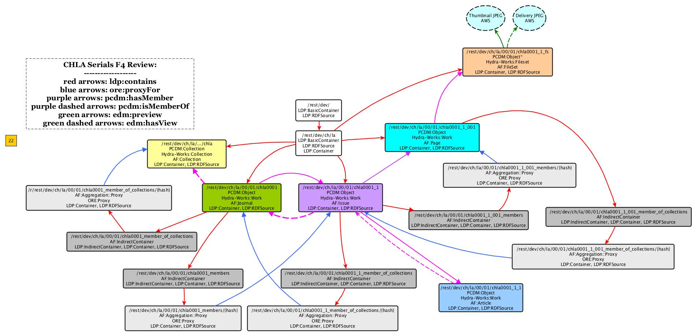

# CHLA Serials

Notes here primarily for metadata normalization + entity matching work planned, confirmed mappings (for 'interim Simple RDF' plan) moved to the finalized mappings [Box spreadsheet](https://cornell.box.com/s/egu0slwx19xz9euxcgj428c9esvpuyzq).

Files covered here: /cul/data/collections/chla/xml_files/chla-s-[number/letters].xml (from hydraedit-dev server).

## Overview of Existing Metadata Usage in DLXS XML for CHLA Serials
```
/DLPSTEXTCLASS/HEADER/ENCODINGDESC/EDITORIALDECL/P: |=========================|  22340/22340 | 100%
/DLPSTEXTCLASS/HEADER/FILEDESC/EDITIONSTMT/EDITION: |                         |    240/22340 |   1%
             /DLPSTEXTCLASS/HEADER/FILEDESC/EXTENT: |======================== |  22332/22340 |  99%
     /DLPSTEXTCLASS/HEADER/FILEDESC/NOTESSTMT/NOTE: |==========               |   9473/22340 |  42%
/DLPSTEXTCLASS/HEADER/FILEDESC/PUBLICATIONSTMT/IDNO: |======================== |  22332/22340 |  99%
/DLPSTEXTCLASS/HEADER/FILEDESC/PUBLICATIONSTMT/PUBLISHER: |======================== |  22332/22340 |  99%
/DLPSTEXTCLASS/HEADER/FILEDESC/PUBLICATIONSTMT/PUBPLACE: |======================== |  22332/22340 |  99%
 /DLPSTEXTCLASS/HEADER/FILEDESC/SERIESSTMT/TITLE/A: |======================== |  22332/22340 |  99%
/DLPSTEXTCLASS/HEADER/FILEDESC/SOURCEDESC/BIBL/AUTHOR: |====================     |  18613/22340 |  83%
/DLPSTEXTCLASS/HEADER/FILEDESC/SOURCEDESC/BIBL/DATE: |======================== |  22332/22340 |  99%
/DLPSTEXTCLASS/HEADER/FILEDESC/SOURCEDESC/BIBL/PUBLISHER: |======================   |  20515/22340 |  91%
/DLPSTEXTCLASS/HEADER/FILEDESC/SOURCEDESC/BIBL/PUBPLACE: |======================   |  20515/22340 |  91%
/DLPSTEXTCLASS/HEADER/FILEDESC/SOURCEDESC/BIBL/TITLE: |======================== |  22332/22340 |  99%
   /DLPSTEXTCLASS/HEADER/FILEDESC/TITLESTMT/AUTHOR: |====================     |  18627/22340 |  83%
    /DLPSTEXTCLASS/HEADER/FILEDESC/TITLESTMT/TITLE: |=========================|  22340/22340 | 100%
       /DLPSTEXTCLASS/HEADER/PROFILEDESC/TEXTCLASS: |                         |      8/22340 |   0%
/DLPSTEXTCLASS/HEADER/PROFILEDESC/TEXTCLASS/KEYWORDS: |==                       |   1817/22340 |   8%
/DLPSTEXTCLASS/HEADER/PROFILEDESC/TEXTCLASS/KEYWORDS/TERM: |======================   |  20515/22340 |  91%
    /DLPSTEXTCLASS/TEXT/BODY/DIV1/DIV2/HEAD/AUTHOR: |=====================    |  19456/22340 |  87%
     /DLPSTEXTCLASS/TEXT/BODY/DIV1/DIV2/HEAD/TITLE: |======================== |  22091/22340 |  98%
              /DLPSTEXTCLASS/TEXT/BODY/DIV1/DIV2/P: |====                     |   3956/22340 |  17%
            /DLPSTEXTCLASS/TEXT/BODY/DIV1/DIV2/P/P: |=====================    |  19197/22340 |  85%
                /DLPSTEXTCLASS/TEXT/BODY/DIV1/HEAD: |=========================|  22340/22340 | 100%
                   /DLPSTEXTCLASS/TEXT/BODY/DIV1/P: |=====                    |   5105/22340 |  22%
                 /DLPSTEXTCLASS/TEXT/BODY/DIV1/P/P: |=====================    |  19142/22340 |  85%
```

## Proposed PCDM Model for 'Simple RDF' interim
A lot of this is written with short and mid term future metadata work (normalization, entity resolution/URI retrieval, more robust dig collection descriptive metadata ontology written) in mind. See [the CUL Digital Collections Metadata Application Profile](../CULPCDM.md) for a high-level review of the PCDM model and profiles used.

### Current CHLA Serials Structural Model in Digital Collections Fedora 4.7 Model

Incomplete - decision around how to handle Article ordering is not yet made.



### PCDM:Collection > HydraWorks:Collection : Digital Collection
This is the collection resource representing CHLA Digital Collection.

#### Descriptive Profile

predicate | value | notes
--- | --- | ---
**dcterms:title** | "Huntington Free Library Native American Collection"^^xsd:string | Need language typing
**dcterms:abstract** | "One of the largest collections of books and manuscripts of its kind, the Huntington collection contains extensive materials documenting the history, culture, languages, and arts of the native tribes of both North and South America. Contemporary politics and human rights issues are also important components of the collection. Full text of a selection of 91 books from the Huntington Free Library Native American Collection representing the various genres in the collection."^^xs:string | Need language typing
**dcterms:date** | "2010"^^<http://id.loc.gov/datatypes/edtf> | Need date (data type) typing. Make sure is not dcterms:created
**dcterms:identifier** | "6790930" | identifier typing to be added in phase 2 of migration.
**dc:publisher** | "Cornell University. Library"@en-us | To be removed upon being able to leverage context class URIs (below)
**dcterms:publisher** | <http://id.loc.gov/authorities/names/n85179829> | leveraging this to be added in phase 2 of migration.
**dcterms:relation** | <https://rare.library.cornell.edu/collections/amerhist/amerindianhist> | n/a

#### Structural Profile

- *Digital Collection <-PCDM:isMemberOf- Repository Work* (only this due to the Fedora 4 inverse membership work around for performance)
- *Digital Collection <-ore:proxyFor- Repository Work Member of Collections Proxies (part of that inverse membership/inverse containment work as well)*
- *Digital Collection <-ldp:contains- Digital Collection Fedora Container under /rest/dev*

#### SPARQL Update for CHLA Collection Descriptive Metadata Repair

On <http://hydraedit-dev.library.cornell.edu:8080/fedora/rest/dev/ >

```
TBD
```

### PCDM:Work > HydraWorks:Work : Series
This is the series or journal resource.

#### Journal Descriptive Profile

field name | predicate | mapping or collection-wide static value [range] | notes
--- | --- | --- | ---
abstract | **dcterms:abstract** | Nothing in existing DLXS XML to map [xs:string] | n/a
alternate title | **dcterms:alternative** | Nothing in existing DLXS XML to map [xs:string] | n/a
contributor | **dc:contributor** | Nothing in existing DLXS XML to map [literal] | n/a
notes | **dcterms:description** | HEADER/FILEDESC/NOTESSTMT/NOTE | will need cleanup.
source | **dcterms:source** | HEADER/FILEDESC/PUBLICATIONSTMT/IDNO before first _ [literal] | n/a
title | **dcterms:title** | HEADER/FILEDESC/SERIESSTMT/TITLE/A | needs clean-up, deduping across issues. Can use HEADER/FILEDESC/SERIESSTMT/TITLE/A@HREF to dedupe.

#### Structural Profile

- *Journal -PCDM:hasMember-> Issue*
- *Issue <-PCDM:isMemberOf- Journal*

### PCDM:Object > HydraWorks:Work | Issue
These are specific Issues of the Journal. It's uncertain we will be able to determine these from the DLXS-migrated data.

#### Descriptive Profile

field name | predicate | mapping or collection-wide static value [range] | notes
--- | --- | --- | ---
id | **dcterms:identifier** | HEADER/FILEDESC/PUBLICATIONSTMT/IDNO before second _ [literal] | n/a
edition | **bibo:version** | HEADER/FILEDESC/EDITIONSTMT/EDITION | Edition statements. To be cleaned up/normalized. Wanted to use BIBFRAME, but can't claim PCDM-Work:Work are BF2:Instance instances. BIBO:Document seems a safer declaration for the time being.
repository | **dc:publisher** | HEADER/FILEDESC/ PUBLICATIONSTMT/PUBLISHER | Entity resolution candidate. At Issue level because seems like the DLXS XML records apply to issues and articles, not series titles.
HEADER/FILEDESC/SOURCEDESC/BIBL/AUTHOR | **marcrel:issuingBody** | prime entity resolution candidate
HEADER/FILEDESC/SOURCEDESC/BIBL/DATE | **dcterms:date** | needs normalization.
HEADER/FILEDESC/SOURCEDESC/BIBL/PUBLISHER | **dc:publisher** | needs normalization. appears to be at issue level.
FILEDESC/SOURCEDESC/BIBL/PUBPLACE | **vivo:placeOfPublication** | needs clean-up? Is at issue level?
FILEDESC/SOURCEDESC/BIBL/TITLE | **dcterms:title** | at the issue level. source of normalization later for issue numbers, etc.
HEADER/PROFILED ESC/TEXTCLASS/KEYWORDS/TERM | **dc:subject** | issue level? Needs normalization.

#### Structural Profile

- *Issue -PCDM:hasMember-> Article*
- *Issue <-PCDM:isMemberOf- Article*
- *Issue -PCDM:hasMember-> Page*
- *Issue <-PCDM:isMemberOf- Page*

### PCDM:Object > HydraWorks:Work | Article
Articles that belong to a particular Issue. This seems to be the level that files and OCR sit at (thus nullifying the need for page objects - but need to confirm).

Will require a lot of metadata improvements.

#### Descriptive Profile

field name | predicate | mapping or collection-wide static value [range] | notes
--- | --- | --- | ---
id | **dcterms:identifier** | HEADER/FILEDESC/PUBLICATIONSTMT/IDNO [literal] | n/a
author | **marcrel:author?** | TEXT/BODY/DIV1/DI V2/HEAD/AUTHOR | Needs checking, normalization.
title | **dcterms:title** | TEXT/BODY/DIV1/DI V2/HEAD/TITLE | n/a
OCR | **dcterms:relations** | TEXT/BODY/DIV1/DI V2/P/P | This is at article level?

#### Structural Profile

TBD


### PCDM:Object > HydraWorks:Work | AF:Page : Part
Files and OCR appear to be at this level.

#### Descriptive Profile

field name | predicate | mapping or collection-wide static value [range] | notes
--- | --- | --- | ---
form | **dc:format** | "Page" [literal] | n/a
form URI | **dcterms:format** | "pages" Getty Vocab [Concept URI] | Add these now. Replace empty assertions.
heading | **ons:heading** |  [literal] | n/a
identifier | **dcterms:identifier** |  [literal] | Will need identifier typing (phase 2 work).
node | **ons:node** |  [literal] | n/a
node type | **ons:node_type** |  [literal] | n/a
OCR | **dc:relation** | [literal] OCR | Should only apply to the part.
page number | **ons:page_number** |  [xs:integer] | n/a
subject | **dc:subject** | Nothing in existing DLXS XML to map  [literal] | Should only apply to the part. Remove empty assertions.
title | **dcterms:title** |  [literal] | We will want to clean these up, make them human-readable.

#### Structural Profile

- *Page -PCDM:hasMember-> FileSet*
- *Page <-PCDM:isMemberOf- FileSet*


### PCDM:Object < HydraWorks:FileSet : FileSet
This is the digital work as represented by file sets - so any information about the digitization and the filesets are related directly to these objects, but descriptive metadata about the intellectual work (the bulk of the descriptive metadata) is used with the above Work instances.

#### Technical & Provenance Metadata Profile

- **dcterms:rights**
- **dcterms:rightsHolder**
- **dc:rights**
- **dcterms:description**
- **dcterms:identifier**
- **dcterms:extent** = FILEDESC/EXTENT [should be resource, will be literal- see intellectual work extent for this issue] => files_extent
- **dcterms:title** = TEXT/BODY/DIV1/HEAD [literal] => fileset_title

#### Structural Profile

- *File Set -PCDM:hasFile-> File(s)*
- *File Set <-PCDM:isFileOf- File(s)*

### PCDM:File < HydraWorks:File : File

Files are kept in Amazon Web Service. Should check embedded metadata profile at a later date.
