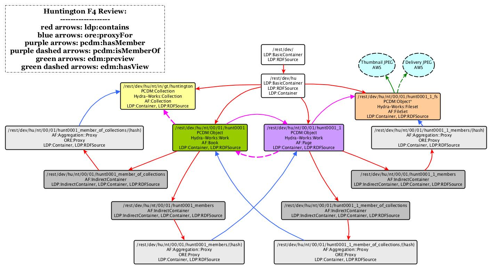

# Hunt.xml

Notes here primarily for metadata normalization + entity matching work planned, confirmed mappings (for 'interim Simple RDF' plan) moved to the finalized mappings [Box spreadsheet](https://cornell.box.com/s/egu0slwx19xz9euxcgj428c9esvpuyzq).

Hunt or Huntington is 124 digitized books. Most books have bibliographic records in the Catalog for the analog versions.

## Overview of Existing Metadata Usage in DLXS XML for Hunt
```
       /record/ENCODINGDESC/EDITORIALDECL/P: |=========================|    124/124 | 100%
                    /record/FILEDESC/EXTENT: |=========================|    124/124 | 100%
      /record/FILEDESC/PUBLICATIONSTMT/IDNO: |=========================|    124/124 | 100%
 /record/FILEDESC/PUBLICATIONSTMT/PUBLISHER: |=========================|    124/124 | 100%
  /record/FILEDESC/PUBLICATIONSTMT/PUBPLACE: |=========================|    124/124 | 100%
    /record/FILEDESC/SOURCEDESC/BIBL/AUTHOR: |=========================|    124/124 | 100%
      /record/FILEDESC/SOURCEDESC/BIBL/DATE: |=========================|    124/124 | 100%
      /record/FILEDESC/SOURCEDESC/BIBL/NOTE: |=========================|    124/124 | 100%
 /record/FILEDESC/SOURCEDESC/BIBL/PUBLISHER: |=========================|    124/124 | 100%
  /record/FILEDESC/SOURCEDESC/BIBL/PUBPLACE: |=========================|    124/124 | 100%
     /record/FILEDESC/SOURCEDESC/BIBL/TITLE: |=========================|    124/124 | 100%
          /record/FILEDESC/TITLESTMT/AUTHOR: |=========================|    124/124 | 100%
           /record/FILEDESC/TITLESTMT/TITLE: |=========================|    124/124 | 100%
/record/PROFILEDESC/TEXTCLASS/KEYWORDS/TERM: |=========================|    124/124 | 100%
                /record/TEXT/BODY/DIV1/HEAD: |=========================|    124/124 | 100%
```

## Overview of Existing Solr Usage for Hunt in Fedora 3
```
                   _version_: |=========================|    124/124 | 100%
     active_fedora_model_ssi: |=========================|    124/124 | 100%
        author_creator_tesim: |=========================|    124/124 | 100%
                    author_t: |=========================|    124/124 | 100%
                author_tesim: |=========================|    124/124 | 100%
        bibl_titletype_tesim: |=========================|    124/124 | 100%
                  book_id_ts: |=========================|    124/124 | 100%
              book_ocr_tesim: |=======================  |    119/124 |  95%
            collection_tesim: |=========================|    124/124 | 100%
creation_site_location_tesim: |=========================|    124/124 | 100%
         creator_facet_tesim: |=========================|    124/124 | 100%
                   creator_t: |=========================|    124/124 | 100%
                  date_tesim: |=                        |      5/124 |   4%
       editorialdecl_n_tesim: |=========================|    124/124 | 100%
                extent_tesim: |=========================|    124/124 | 100%
                format_tesim: |=========================|    124/124 | 100%
              has_model_ssim: |=========================|    124/124 | 100%
              has_pages_ssim: |=========================|    124/124 | 100%
                          id: |=========================|    124/124 | 100%
             latest_date_isi: |=========================|    124/124 | 100%
          object_profile_ssm: |=========================|    124/124 | 100%
            object_state_ssi: |=========================|    124/124 | 100%
               pubdate_tesim: |=========================|    124/124 | 100%
             publisher_tesim: |=========================|    124/124 | 100%
              pubplace_tesim: |=========================|    124/124 | 100%
          pubstmt_idno_tesim: |=========================|    124/124 | 100%
     pubstmt_idno_type_tesim: |=========================|    124/124 | 100%
     pubstmt_publisher_tesim: |=========================|    124/124 | 100%
      pubstmt_pubplace_tesim: |=========================|    124/124 | 100%
      repository_place_tesim: |=========================|    124/124 | 100%
            repository_tesim: |=========================|    124/124 | 100%
                       score: |=========================|    124/124 | 100%
               subject_tesim: |=========================|    124/124 | 100%
          system_create_dtsi: |=========================|    124/124 | 100%
        system_modified_dtsi: |=========================|    124/124 | 100%
                   timestamp: |=========================|    124/124 | 100%
                   title_ssi: |=========================|    124/124 | 100%
                 title_tesim: |=========================|    124/124 | 100%
      titlestmt_author_tesim: |=========================|    124/124 | 100%
       titlestmt_title_tesim: |=========================|    124/124 | 100%
   titlestmt_titletype_tesim: |=========================|    124/124 | 100%
```

## Proposed PCDM Model for 'Simple RDF' interim
A lot of this is written with short and mid term future metadata work (normalization, entity resolution/URI retrieval, more robust dig collection descriptive metadata ontology written) in mind. See [the CUL Digital Collections Metadata Application Profile](../CULPCDM.md) for a high-level review of the PCDM model and profiles used.

### Current Huntington Structural Model in Digital Collections Fedora 4.7 Model



### PCDM:Collection > HydraWorks:Collection : Digital Collection
This is the collection resource representing Huntington Digital Collection.

#### Descriptive Profile

- **dcterms:title** = "Huntington Free Library Native American Collection"^^xs:string
- **dcterms:abstract** = "One of the largest collections of books and manuscripts of its kind, the Huntington collection contains extensive materials documenting the history, culture, languages, and arts of the native tribes of both North and South America. Contemporary politics and human rights issues are also important components of the collection. Full text of a selection of 91 books from the Huntington Free Library Native American Collection representing the various genres in the collection."^^xs:string
- **dcterms:date** = "2010"^^<http://id.loc.gov/datatypes/edtf>
- **dcterms:identifier** = "6790930" (typing to be added in phase 2)
- **dc:publisher** = "Cornell University. Library"^^xs:string
- **dcterms:publisher** = <http://id.loc.gov/authorities/names/n85179829> (leveraging this to be added in phase 2)
- **dcterms:relation** = <https://rare.library.cornell.edu/collections/amerhist/amerindianhist>

#### Structural Profile

- *Digital Collection <-PCDM:isMemberOf- Repository Work* (only this due to the Fedora 4 inverse membership work around for performance)

### PCDM:Collection > HydraWorks:Collection : Set
This is a generic set used as needed for further differentiation of works and collections. Not required. Not used in Huntington.

Descriptive metadata available on this class:

- **dcterms:title** = n/a [literal] => set_title
- **dcterms:abstract** = n/a [literal] => set_abstract
- **dcterms:created** = n/a [literal, EDTF] => set_date
- **dcterms:identifier** = n/a [literal, typed as able] => set_id
- **dc:publisher** = n/a [literal] => set_publ
- **dcterms:publisher** = n/a [URI < dcterms:Agent] => set_publ
- **dcterms:relation** = n/a [URL] => set_relatedURL

PCDM + Other RDF Relationships on this class:
*Set -PCDM:hasMember-> Intellectual Work*

*Set <-PCDM:isMemberOf- Intellectual Work*

### PCDM:Object > HydraWorks:Work & > dpla:SourceResource : Intellectual Work
This is the intellectual work represented by the Digital Work. The bulk of the descriptive metadata is here. Eventually, we may look into the option of having this object generated through a RDF Shape on an external triplestore containing more robust intellectual work metadata (and metadata ontologies). While one could, theoretically, have an Intellectual Work for each Digital Work Object Level (or the Digital Collection itself), we are limiting Intellectual Works for the time being to those represented roughly by bibliographic objects - with an eye to system efficiency and object interoperability in delineating this (especially when we get into journals). Resource abstractions/domain models like FRBR or RDA:Work etc. are not to be used here. 'Work' is used in a broader way.

Not typing as subclass of DPLA:SourceResource in this permutation of implementation. Want to consider in the future leveraging the 'aggregation' object aspect to possibly pull metadata objects into this work.

Descriptive metadata available on this class (at least for Huntington, more to be added as other collections are mapped + migrated to Fedora 4):

- **dcterms:abstract** = Nothing in existing DLXS XML to map [literal] => abstract
- **dcterms:alternative** = Nothing in existing DLXS XML to map [literal] => alt_title
- **dc:contributor** = Nothing in existing DLXS XML to map [literal:prefLabel] => contributor
- **dcterms:contributor** = Nothing in existing DLXS XML to map [non-literal:external URI] => contributor_uri (would rather have this than literal/above, but is part of entity resolution project that comes after fedora 4 migration)
- **dc:creator** = FILEDESC/SOURCEDESC/BIBL/AUTHOR [literal] => creator
- **dcterms:creator** = to be matched [non-literal;entity resolution URIs] => creator_uri (same note re: URI/literal for dcterms:contributor)
- (additional role terms will be added from RDAU or LoC Relators as encountered in upcoming collections mappings)
- **dcterms:created** = FILEDESC/SOURCEDESC/BIBL/DATE => date [literal] no encoding type asserted (would like to type as date/fix encoding. may want separate date text and date key fields in that instance.)
- **dcterms:description** = Nothing in existing DLXS XML to map [literal] => description
- **dcterms:extent** = FILEDESC/SOURCEDESC/BIBL/NOTE [should be URI but uncertain about possibility object_profile_ssm subclassing/moving to resource for now] => intell_extent
- **dc:format** = "books" => form
- **dcterms:format** = "books" from chosen vocab URI [non-literal:external URI] => form (avoid until integrating fedora w/authorities + URIs is discussed)
- **dcterms:identifier** = Nothing in existing DLXS XML to map [literal] => identifier (will want to type eventually for type of identifier = marcbib, dlxs, other?)
- **dcterms:language** = Nothing in existing DLXS XML to map => language (we will want to add this in the mid-term future, but requires manual review? Also question of external URIs)
- **VIVO:placeOfPublication** = FILEDESC/SOURCEDESC/BIBL/PUBPLACE [literal; note: this is a datatype property] => pubplace
- **dc:publisher** = FILEDESC/SOURCEDESC/BIBL/PUBLISHER => publisher
- **dcterms:publisher** = not used currently [non-literal;entity resolution candidate] => publisher
- **EDM.currentLocation** = FILEDESC/PUBLICATIONSTMT/PUBLISHER [non-literal, edm:Place instance] => repository (will be external URI - cheat with literal until entity resolution project?)
- **dc:rights** = Nothing in existing DLXS XML to map [literal; text statement when URI/community rights standard hasn't been used with dcterms:rights] => intell_rights
- **dcterms:rights** = Nothing in existing DLXS XML to map [non-literal; URI for any community-assigned rights] => intell_rights
- **dcterms:rightsHolder** = intellectual resource rights holder if they exist (none do at present for Huntington) [non-literal; will require probably local URI for entity] => intell_rightsHolder
- **dc:subject** = PROFILEDESC/TEXTCLASS/KEYWORDS/TERM [literal] => subject (all types together at present)
- **dcterms:subject** = not currently used [non-literal; will be the URIs for the resolved literals in dc:subject] => subject (all types together at present)
- **dcterms:title** = FILEDESC/SOURCEDESC/BIBL/TITLE[@TYPE='main']  [literal] => title
- **dc:type** = "Text" [literal: URI, entity resolution candidate to create dcterms:type] => item_type
- **dcterms:type** = external URI for "Text" [non-literal: URI, entity resolution candidate] => item_type
- **dc:relation** = OCR Text (the actual text, not a file/fedora obj URI) => ocr (wanted more granular term to capture this field - as we don't keep the OCR as a separate file - but just am not finding anything without domain/range restrictions).
- **dcterms:isPartOf** = PCDM:Collection URI < dcterms:Collection => need to discuss further, as part of ease of Solr creation for collection label. How to handle dcmi:Collection variances from PCDM:Collection?

PCDM + Other RDF Relationships on this class:

If there is a Part:
*Intellectual Work -PCDM:hasMember-> Part*

*Intellectual Work <-PCDM:isMemberOf- Part*

If there is no Part:
*Intellectual Work -PCDM:hasMember-> File Set*

*Intellectual Work <-PCDM:isMemberOf- File Set*

### PCDM:Object > HydraWorks:Work == Part (Secondary Intellectual Work), as needed
Digitization and description efforts should work to capture discrete Intellectual Works such that the metadata on the top level Intellectual Work class instance covers the parts as needed. We're not trying to create intellectual works all the way down, but the current Curation Concerns/HydraWork expectations of PCDM make this (and conflation of digital and intellectual works) hard to avoid.

Descriptive metadata available on this class:

- to be added as encountered.
- **dcterms:title** [literal]  (if used at part-level)
- **dc:subject** [literal]  (if used at part-level)
- **dc:relation** [literal] OCR (if used at part-level)

PCDM + Other RDF Relationships on this class:

*Digital Work|Part -PCDM:hasMember-> File Set*

*Digital Work|Part <-PCDM:isMemberOf- File Set*

### PCDM:Object < HydraWorks:FileSet : File Set / Digital Work
This is the digital work as represented by file sets - so any information about the digitization and the filesets are related directly to these objects, but descriptive metadata about the intellectual work (the bulk of the descriptive metadata) is used with the Intellectual Work class. This allows us to make descriptive metadata assertions (such as format = manuscripts, or rights = digital asset viewing and reuse rights) that aren't in conflict with digital object descriptions (format = jpeg or rights = physical resource access or reuse rights).

Descriptive metadata available on this class:

- **dcterms:rights**
- **dcterms:rightsHolder**
- **dc:rights**
- **dcterms:description**
- **dcterms:identifier**
- **dcterms:extent** = FILEDESC/EXTENT [should be resource, will be literal- see intellectual work extent for this issue] => files_extent
- **dcterms:title** = TEXT/BODY/DIV1/HEAD [literal] => fileset_title
- anything else file set specific, as encountered (crossing into technical metadata)

PCDM + Other RDF Relationships on this class:

*File Set -PCDM:hasFile-> File(s)*

*File Set <-PCDM:isFileOf- File(s)*

### PCDM:File < HydraWorks:File : File

Descriptive metadata available on this class:

- anything each file specific as stored in the original DLXS 'descriptive' metadata, as encountered (crossing into technical metadata).

The following is taken from PCDM technical metadata recommendations (which we should take with a grain of salt, if at all)
- **ebucore:filename** = filename
- **ebucore:fileSize** = file size in bytes
- **rdfs:label** = file label
- **ebucore:dateCreated** = date file was created


##Mapping from DLXS XML to "Simple RDF" (with normalization notes)

Field | Concept | RDF Mapping | Notes
--- | --- | --- | ---
**ENCODINGDESC/EDITORIALDECL/P** | *Note* | pcdm:object[hydraWork:GenericWork] dcterms:description [literal] | OCR is not kept as separate file, but text referred to by descriptive metadata. Move Solr concept to technical note.
**FILEDESC/EXTENT** | Extent | pcdm:object[hydraWork:GeneralFile] ? [literal] | This is extent for collection of digital objects/files attached to one resource/work. Doesn't describe each file at the file-level. Ex: "112 600dpi TIFF page images"
**FILEDESC/PUBLICATIONSTMT/IDNO** | Identifier | pcdm:object[dpla:SourceResource] dcterms:identifier [literal] | there only seems to be these dlxs identifiers used, wondering if we'll need to type this later on.
**FILEDESC/PUBLICATIONSTMT/PUBLISHER** | Repository | pcdm:object[dpla:sourceResource] **edm:currentLocation** [literal until we can pull in external URIs] | can't find other property that adequately covers repository without going beyond scope of current options. Prime entity resolution candidate.
**FILEDESC/PUBLICATIONSTMT/PUBPLACE** | Repository location? | Don't map | This is the location of the repository, captured above. Do we need? Otherwise can repeat edm:currentLocation or concatenate fields in some way.
**FILEDESC/SOURCEDESC/BIBL/AUTHOR** | Creator | pcdm:object[dpla:SourceResource] dcterms:creator [literal until we can pull in external URIs] | Some are many creators concatenated, others contain role terms. Look into possibility of using more specific marcrel properties for these role terms (and removing role term from literal value). e.g. "Wells, Roger A.E., compiler" => pcdm:object marcrel:compiler "Wells, Roger A.E."@en. Prime entity resolution candidate.
**FILEDESC/SOURCEDESC/BIBL/DATE** | Date | pcdm:object[dpla:SourceResource] dcterms:created [literal] | 1 value has a reprint note attached, some use of dashes (inconsistent) for ranges, 1 questionable/unknown value. Look into remediation for then assigning encoding datatype to these literals? EDTF or a more generic ISO standard?
**FILEDESC/SOURCEDESC/BIBL/NOTE** | Extent (not originally mapped) | pcdm:object[dplaSourceResource] ?? [literal] | this is the physical resource extent and should be attached to the object describing that resource (unlike extent above, which is more about digital file extent). Not sure why it is in a Note field.
**FILEDESC/SOURCEDESC/BIBL/PUBLISHER** | Publisher | pcdm:object[dpla:SourceResource] dc:publisher [literal] | this is the physical resource's actual publisher, not the digitizer nor the repository. Looks transcribed, so normalization is limited (pick this up with RDA folks in LTS at some point).  Otherwise, entity resolution candidate (except this was turned down).
**FILEDESC/SOURCEDESC/BIBL/PUBPLACE** | Creation location | pcdm:object[dpla:SourceResource] vivo:placeOfPublication [literal] | LD4L option has domain/range restrictions that make it not good option for this. Not sure I like the data property route - what if we want to normalize/resolve placenames (i.e. make into objects)? Need to keep looking.
**FILEDESC/SOURCEDESC/BIBL/TITLE[@TYPE='main']** | Title | pcdm:object[dpla:SourceResource] dcterms:title [literal] | same values appears as FILEDESC/TITLESTMT/TITLE (below)
**FILEDESC/TITLESTMT/AUTHOR** | skip | skip | Creator values, appears to be same as FILEDESC/SOURCEDESC/BIBL/AUTHOR which is mapped
**FILEDESC/TITLESTMT/TITLE** | skip | skip | Title values, appears to be same as FILEDESC/SOURCEDESC/BIBL/TITLE which is mapped
**PROFILEDESC/TEXTCLASS/KEYWORDS/TERM** | Subject | pcdm:object[dpla:SourceResource] dc:subject [literal] | dcterms:subject is meant to be used with non-literal values, according to DCMI. Can consider using when we map these to external URIs (most should be fairly straight forward entity matching). Replace ' - ' with '--' is first step towards LC-influenced normalization.
**TEXT/BODY/DIV1/HEAD** | structural metadata | pcdm:object(hydraWork:GeneralFile) dcterms:title [literal] | this appears to be the label/kind of files represented in the requisite wrapper element.
**BODY** | Structural Metadata | |
**DIV1** | Structural Metadata | |
**PB** | Structural Metadata | |

